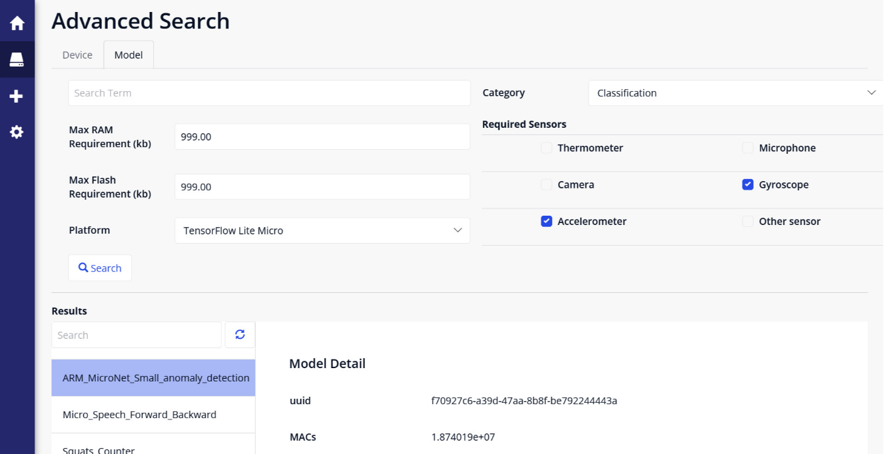
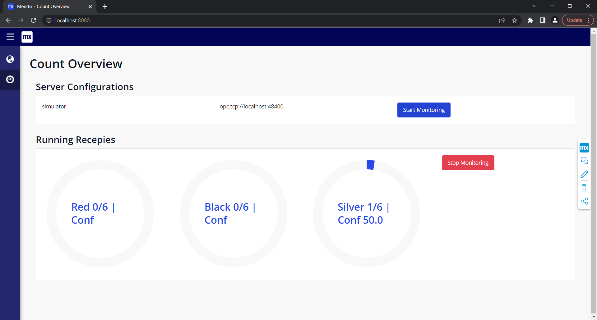

# Mendix Application
Here we present a guide to run the Mendix component of SeLoC-ML.

## How to Run
[Mendix Studio Pro](https://marketplace.mendix.com/link/studiopro/) is the go-to IDE in order to develop mendix modules. More specifically, we developed our module using [v9.8.1](https://marketplace.mendix.com/link/studiopro/9.8.1). This is important to mention as earlier versions will not be able to compile the project and later versions would require a conversion (done automatically by the IDE) to compile it.

Once you have Mendix Studio Pro installed, you can simply download the project from the repository and either run the `app.mpr` from the file explorer or select "Open App Locally" from the start page.

Once the project is running, simply press run and the server would start locally and can be accessed in the browser at `http://localhost:8080`.

## GraphDB Setup
In our concept, we use [GraphDB](https://graphdb.ontotext.com/documentation/free/) to store and visualize information from Neural Network models and IoT devices in a Knowledge Graph (KG) using the various semantic schemas mentioned in our paper. We are able, then, to synchronize and access such information easily in Mendix by establishing a connection to the server hosting the repository containing the Knowledge Graph as shown in the image below.

After syncronizing the data from GraphDB, we are able to carry on the sematic functionalities and matching in the rest of the application.

## Semantic Management
After establishing the connection with GraphDB, we can easily use various semantic services provided by our Mendix application.

- Discovery: developers can browse through all available NN models and devices in the graph database and inspect their details.

- Matchmaking: the matching can be performed in two ways, either by specifying the requirements for a Neural Network to run and discovering which devices meet such requirements or, similarly, specifying IoT devices and performing queries to find out which Neural Networks are compatible given their capabilities.

- Semantic Similarity Search: semantic similarity search enables users to explore relevant objects in the KG by typing a search text, similar to
Google Search.

- ML-as-a-service: depending on the matching results, different deployment options become available, and corresponding project code can be generated by parsing the retrieved information. Of course, specific user configurations will be asked to complete the project creation.

## Festo Robot Connection

The application starts with the OPC-UA server configuration page, where server configurations can be added to connect to and run the recipe configured. The configuration requires a unique identifier, a server URL and an optional authentication configuration.

The recipe can be run for each server configuration separately. When `Start Monitoring` is clicked, an instance of the recipe is created and the monitoring results are displayed under the `Running Recipes` section. As classification data is received via the OPC-UA subscription, it is sorted, the corresponding count is updated, and the most recent confidence value is displayed.

This is just one example of how the data can interpreted and much more can be developed using the same concepts applied here. Please feel free to contact us.